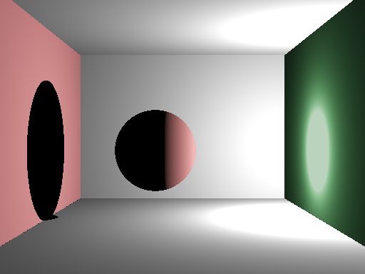
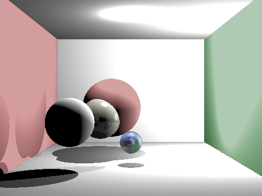
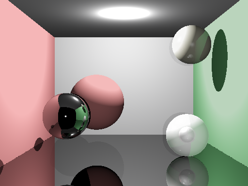

# Renderer
В данном проекте был реализован алгоритм обратной трассировки для рендеринга физически корректрых изображений.

## Возможности:

* модель Фонга
* отражение
* пропускание (закон Снеллиуса)
* сферы и плоскости (прямоугольники)
* сохранение в PPM, TXT
* python скрипт (Renderer/txt2nit.py) в формат Lumicept

### Основной скрипт: ```Renderer/Renderer.cpp```

## Примеры





